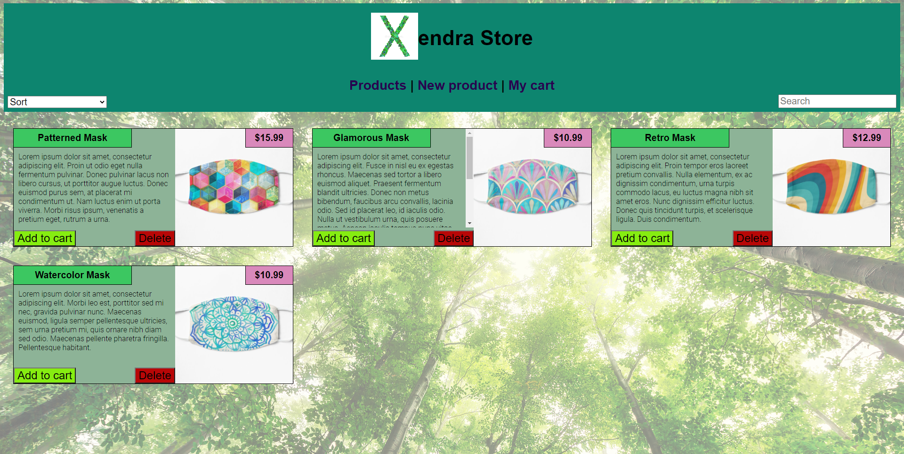

# Online Store single page app

## Screenshots

 

## Description

A responsive online store built as a single page app in HTML, CSS, and vanilla Javascript.

Includes new product page and shopping cart.

## Features

* Responsive design
* Shopping cart
* Ability to add/delete products
* Ability to sort products by name or price, ascending or descending
* Ability to search products by name substring
* Data stored in memory (JS local variables)

## Live demo

A live demo can be accessed at https://alexandra-luca.github.io/online-store

